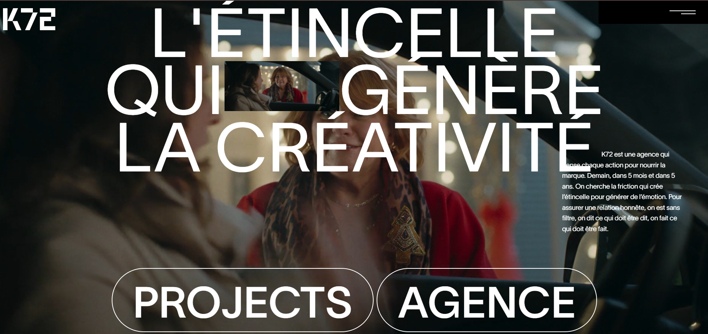

# 🚀 K72 Frontend Website

A modern, animated frontend application built using React, Tailwind CSS, and GSAP.
The project focuses on performance-friendly animations, responsive layouts, and a polished user interface.

📌 Project Overview

This project demonstrates strong frontend fundamentals with an emphasis on:

Component-driven UI development

Smooth animation workflows

Utility-first styling for scalability

Responsive and accessible design

🛠️ Tech Stack

React.js

JavaScript (ES6+)

Tailwind CSS

GSAP

✨ Features

High-quality GSAP animations

Fully responsive across all screen sizes

Clean, modern UI

Reusable and scalable components

Optimized rendering and performance

🎯 What This Project Shows

Advanced frontend animation handling

Real-world React project structure

Efficient styling using Tailwind CSS

Attention to UI/UX detail

📸 Preview

📄 License

For portfolio and learning purposes.